# Shared agent workflow

This contract applies to Codex and Claude Code. Repository guidance is subordinate
to system/developer instructions, runtime permissions and GitHub authorization.
Markdown links are references, not evidence that their contents were loaded.
Read root `AGENTS.md`, this document, and the repository's lifecycle, risk,
learning, approvals and monitoring documents explicitly before work. Reviewers
also load the trusted-base review policy and `REVIEW_TEMPLATE.md`.

## Author route

```mermaid
flowchart LR
    R[Request] --> S[Robotics scope and visible response]
    S --> I[Read-only inspection and clarification checkpoint]
    I --> P[Proposed plan]
    P --> Y[Explicit human yes to current plan]
    Y --> W[Task branch and implementation]
    W --> V[Validation and complete uncommitted diff]
    V --> L[Human learning answers and evaluation]
    L --> C[Commit matching snapshot]
    C --> U[Push and author-template PR]
    U --> A[Independent review and authorized human decision]
```



Classify the actual objective under the root Robotics-Only Scope Policy before
task actions. Ambiguous robotics relevance needs one clarification and a wait;
unrelated work stops. Never invent hardware configuration. For in-scope work,
inspect existing patterns before asking material unresolved questions. The
clarification checkpoint is mandatory; questions are not when inspection and
the request already resolve requirements. State confirmed understanding and
remaining assumptions in the plan.

Every change-producing task requires a visible plan and explicit agreement,
including small changes (which may use a short plan). Include intended behaviour,
non-goals, affected repositories/files, protected paths, risk and reason, steps,
acceptance criteria, exact checks, required approvals and rollback. Before yes,
no implementation edit, task branch, formatting, install, write-producing build,
commit, push or PR mutation. Minimal sanitized lifecycle bookkeeping outside
tracked project files is permitted; it grants no authority. A clarification
answer, earlier approval, silence, generated answer, native tool permission or
the original request is not approval of the current plan. Material scope,
architecture, risk, protected-path or acceptance changes invalidate approval;
stop edits, revise the plan and wait for a new yes.

Validate before learning and commit. Inspect staged, unstaged and intended new
files (including renames, deletions and binaries), preserving unrelated existing
work. Bind validation and learning to repository, task/session, provider, branch,
plan revision, base, complete changed-file list and exact change digest. The
human answers diff-grounded questions in their own words; evaluate correctness
against the actual change. Incorrect or incomplete answers require explanation
and a focused follow-up. Generated explanations, generic wording or length
checks cannot establish correctness or participation. Apply only the target's
existing verified learning exception; the shared Harness practical verification
and two-distinct-current-Mentor rules are not waived by a target exception.

Commits, pushes and author-side PR creation/updates remain blocked until learning
passes for the snapshot. Recheck staged/committed contents before publication.
Changed snapshots invalidate learning and affected validation/approval evidence.
Keep incidental evidence outside the product diff. The PR uses the actual author
template and target promotion model; independent review starts PENDING until a
PR exists. Learning is not merge approval. Never merge or deploy as a side effect.

## Review route

```mermaid
flowchart LR
    R[Review request] --> I[Scope, exact PR and verified gh user]
    I --> P[Short review plan and explicit agreement]
    P --> C[Fresh context and trusted-base policy]
    C --> D[Complete diff and existing CI evidence]
    D --> T[Shared template report]
    T --> A[Human approves exact rendered report]
    A --> F[Recheck actor, head and policy]
    F --> U[COMMENT review with explicit commit SHA]
    U --> V[Read back author, state, SHA and body]
```



Use `review PR #123` or `review PR FRC1884/Season2027#123` in the user's
Codex or Claude Code session. Resolve bare numbers only against the verified
robotics repository. Explicit skill entry points are `$agentic-review` in Codex
and `/agentic-review` in Claude Code. Built-in `/review` is not this contract.
The review-only route never edits implementation, commits, pushes, merges,
deploys or invokes author learning. Its narrowly allowed writes are review
reports/evidence and the separately authorized COMMENT review. Follow
`REVIEW_POLICY.md` for publication and independence.

## Loading, resumption and enforcement limits

Claude's root `CLAUDE.md` imports `@AGENTS.md`; Codex discovers project skills
through `.agents/skills/`. Claude uses `.claude/skills/`. Existing `.codex/skills/agentic-review/` is named `agentic-review-compat`
with implicit invocation disabled: installed Codex compatibility discovery can
scan this location too. It points to the same contract without creating a
second automatically selected review skill.
Inspect nested AGENTS/overrides, CLAUDE files and provider configuration. Missing
references, import cycles, duplicate active skills and generated drift block a
compatibility claim. On a resumed session re-read applicable instructions and
revalidate current plan, actor, repository and change/review digests; do not
inherit stale approval. Record client versions, working directory and fresh/
resumed loading evidence. A fixture PASS is not a real-client loading PASS.

Local action guards check machine-readable preconditions for routed actions.
Editable local state, prompt guidance and hooks are not tamper-proof security
boundaries; direct shell/API calls, unsupported tools and uninstrumented clients
can bypass them. Runtime permissions, hosted branch protection and human decisions
remain separate. Unavailable hosted settings are UNVERIFIED. Required hosted
migrations need explicit authorization and must not silently disable a check.

## Guarded command entry points

Run commands from the repository root using `python3 tools/robotics_harness/entry.py`.
Native SessionStart reports the actual session ID, provider and reserved `inputs`
directory. Reuse those values; do not invent a new session to inherit approvals.
Author commands require `--root`, `--session` and `--provider`; review commands
use `--root`, `--session-id` and `--provider`. For example, with placeholders
replaced by the actual session values:

```text
python3 tools/robotics_harness/entry.py author status --root . --session ACTUAL_SESSION --provider codex
python3 tools/robotics_harness/entry.py review identity --root . --session-id ACTUAL_SESSION --provider codex
```

Use provider `claude` in a Claude Code session. Inspect each route's `--help`
for task inputs and actions. The author sequence is start/propose, an actual
human plan interaction and checkpoint, branch/implementation, validation,
learning, stage/commit/push/pr. Each transition validates its current evidence;
CLI arguments or locally written answers are not proof of human participation.

Review `prepare` also names the repository/PR, verified login, actual client
version, scope reason, every required trusted policy path using repeated
`--policy`, and `--template` (include that file as a policy input too). Do not
assume references are loaded transitively. Its agreement/collection/report steps
are `agree-plan`, `collect`, `stage-report`, `approve-report`, `publish` and
`reconcile`. The actual human interactions for plan and report are separate;
do not reuse an interaction reference or approval digest between them.

Review state is reserved automatically under the current session's `review.json`;
do not supply an arbitrary `--state`. Report input must be a nonsymlink `.md` file
directly under that session's `inputs` directory. `stage-report` receives
`--report-file` and repeated `--inspected-path` for actual coverage. Record
publication/read-back evidence externally without rewriting the approved body.
A provider hook firing proves hook execution, not that its model loaded or
followed policy. Missing model access remains BLOCKED/NOT RUN.

### Revision, ownership and evidence recovery

The author plan includes `integration_base`, bound into the approved plan digest.
It must match the target's configured `author_task_bases`; a Season2027 task
cannot target `main` directly. For a material revision, use `revise`, then
`propose`, then wait for the actual native human yes. `begin` resumes the already
bound task branch after renewed approval. `resume` reopens editing within the
approved scope and invalidates downstream validation/learning/publication
evidence; it does not approve a changed plan.

Existing protected-path preimplementation approval remains separate. Use
`request-owner-approval` to display the current plan and required groups. The
subsequent native human agreement must verify the effective DIFFERENT human
GitHub login and active configured team membership; no automatic account switch
occurs. This gate never replaces the canonical Harness's two distinct current
non-author Mentor PR approvals.

Only the Season2027 target has `request-mentor-override`, available after a
validated prepared snapshot. It verifies the requesting mentor's own live
identity and requires separate explicit native consent for that exact snapshot.
The shared Harness does not inherit this exception. No override has been invoked
for this maintenance task. Learning inputs may refer to previously captured human
answers when correcting a specific incomplete answer; retain provenance and
reevaluate the changed answer against the current snapshot rather than
fabricating a new interaction.

Review `identity` returns the sanitized effective login before the short plan;
do not guess it. After review-plan approval, `collect` defaults to the reserved
bare object store for immutable Git objects. It does not check out or execute PR
code; an optional existing checkout must match the expected repository.

Keep real-client evidence precise: observed documentation loading, hook startup,
hook trust and actual guarded execution are separate claims. At this task's
current checkpoint, real Codex hook trust and guarded execution have not been
observed; documentation loading alone does not establish them. Claude model
access is BLOCKED even where startup hooks fired. Never promote those partial
observations to an end-to-end compatibility PASS.
